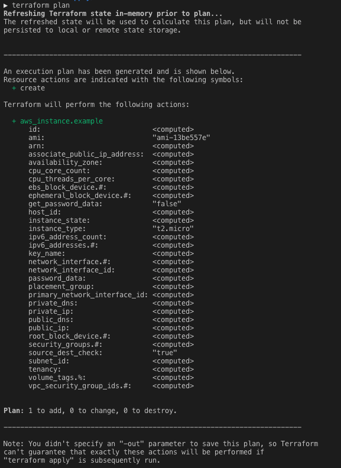
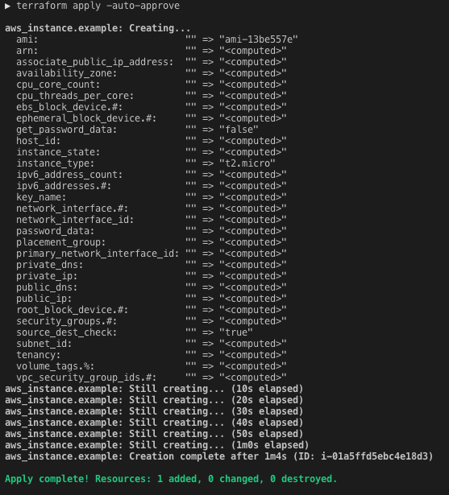

1. Entre na pasta EC2 `cd EC2`
2. Execute o comando `terraform init`
   
3. Agora execute um `terraform plan` para ver o que será executado.
   
4. Agora execute um `terraform apply -auto-approve` para que sejam criados os recursos na AWS.
    
5. Vá até o painel da AWS para ver o recurso criados
    
6. Execute o comando `terraform destroy -auto-approve` para destruir os recursos criados.
   
7. Se for ao painel verá que o recurso realmente não esta mais lá
   
8. Agora saia dessa pasta com o comando `cd ..`
9. Enter na pasta EC2-ssh com o comando `cd EC2-ssh`
10. Nesse exemplo voce utilizará a chave fiap-18cld que criou. Para iniciar o processo execute o comando `terraform init`.
11. Este exemplo irá criar maquinas ec2 e acessar as mesmas para instalar Nginx. Para planejar execute o comando `terraform plan`
12. Se tudo estiver certo execute o comando `terraform apply -auto-approve` 
13. Qunado o trabalho for concluido com sucesso, você pode pegar o ip da maquina criada e colocar no navegar que irá ser exibida uma pagina inicial do Nginx.
    
14. Por fim execute `terraform destroy -auto-approve`
15. Se certifique que o destroy funcionou

